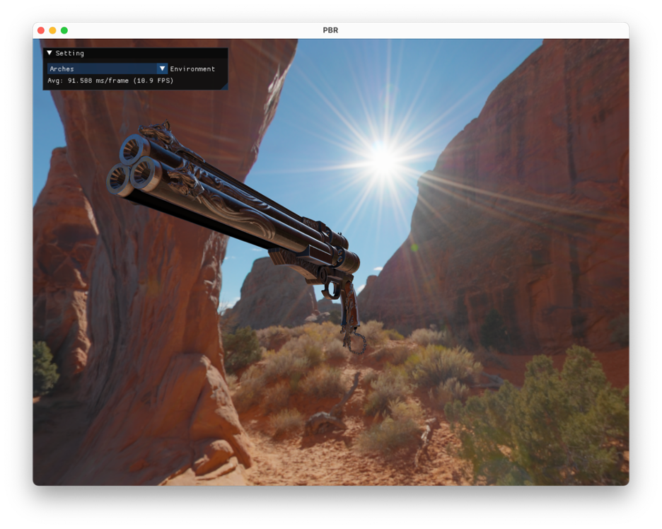
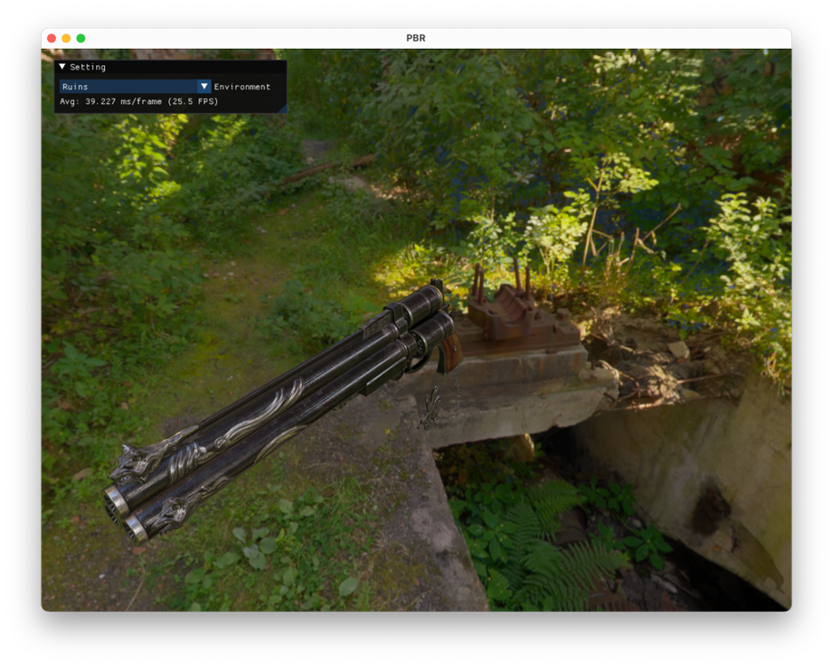
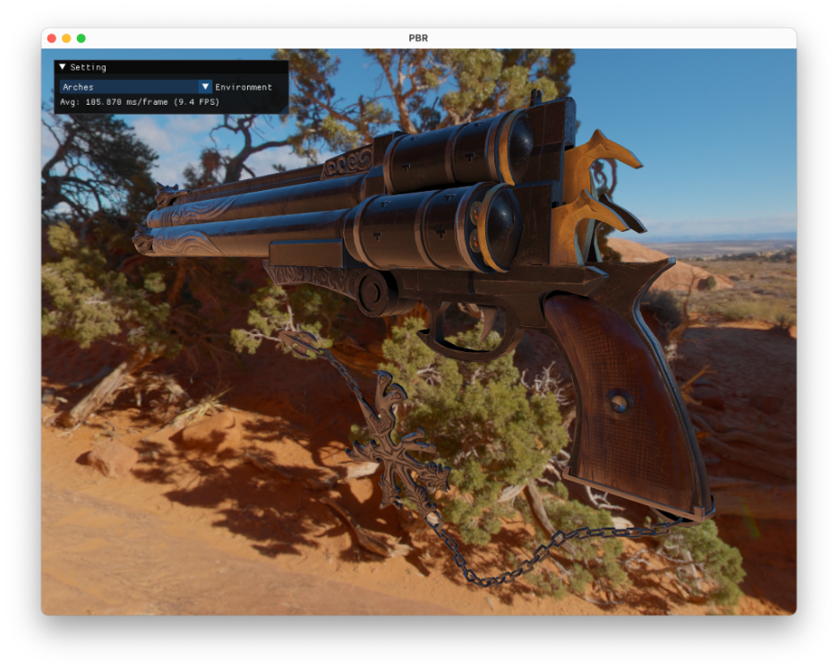
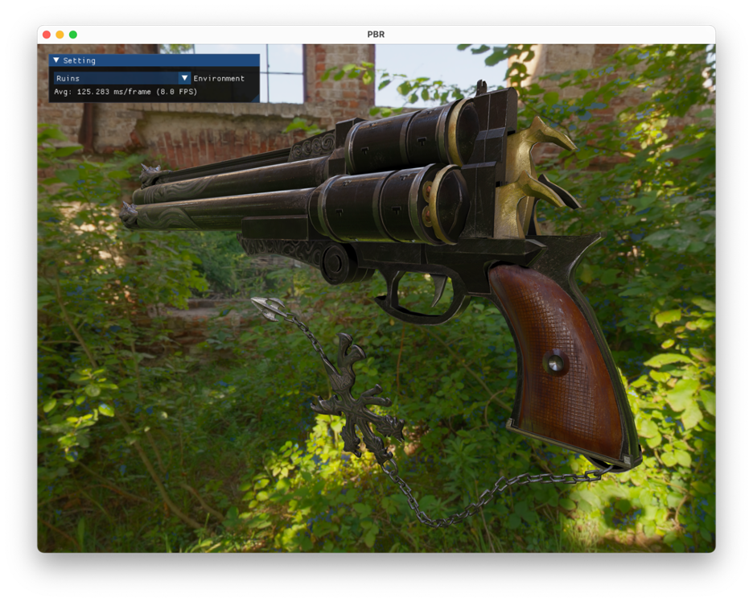

# Physically Based Rendering (PBR)

## Get Started
```
git clone https://github.com/LongerZrLong/PBR.git
cd PBR
make
./main
```

When the program successfully runs, press `h` on keyboard to see help message on terminal.

## Demo
A video demo can be found [here](https://www.youtube.com/watch?v=vOBiQJXB0vk).

## Screenshots



